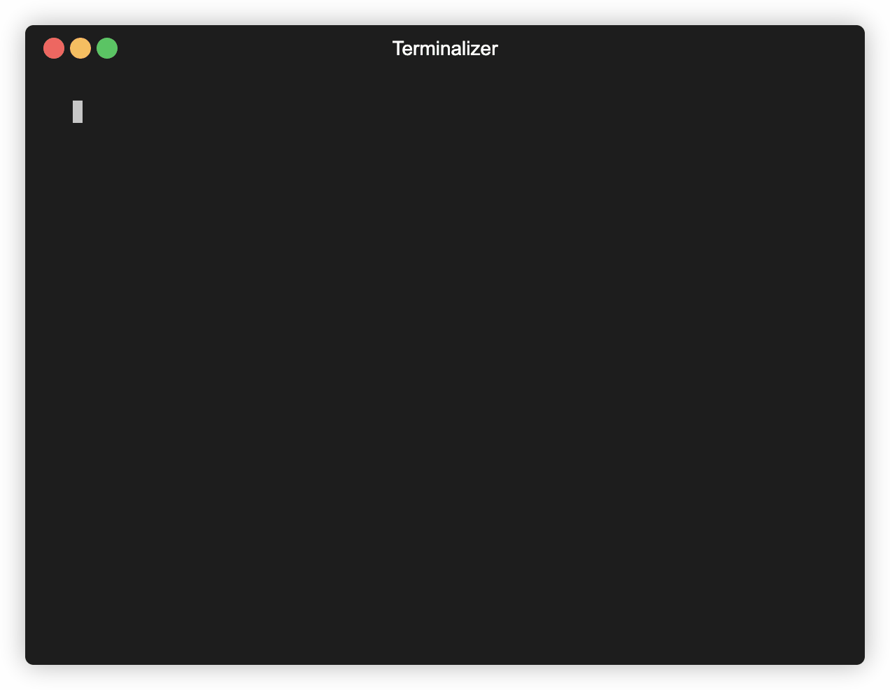
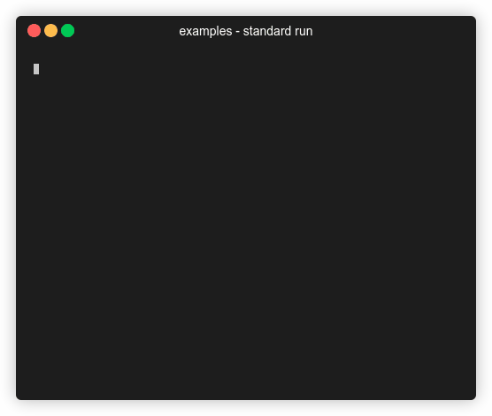
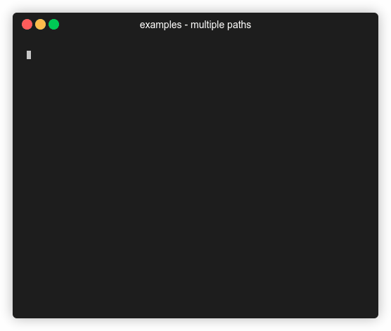
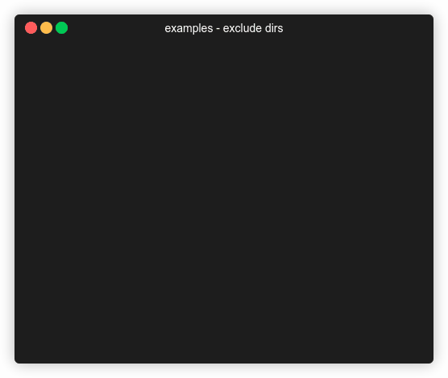

<div align="center">
  
  <h1>Config File Validator</h1>
  <p>Single cross-platform CLI tool to validate different configuration file types</p>
</div>

<p align="center">


  <a href="https://scorecard.dev/viewer/?uri=github.com/Boeing/config-file-validator">
    
  </a>

  <a href="https://www.bestpractices.dev/projects/9027">
    
  </a>

  <a href="https://opensource.org/licenses/Apache-2.0">
  
  </a>

  <a href="https://github.com/avelino/awesome-go">
  
  </a>  

  <a href="https://pkg.go.dev/github.com/Boeing/config-file-validator">
  
  </a>

  <a href="https://goreportcard.com/report/github.com/Boeing/config-file-validator">
  
  </a>

  <a href="https://github.com/boeing/config-file-validator/actions/workflows/go.yml">
  
  </a>
</p>

## Supported config files formats:
* Apple PList XML
* CSV
* EDITORCONFIG
* ENV
* HCL
* HOCON
* INI
* JSON
* Properties
* SARIF
* TOML
* XML
* YAML

## Demo



## Installation
There are several ways to install the config file validator tool

### Binary Releases
Download and unpack from https://github.com/Boeing/config-file-validator/releases

### Aqua
You can install the validator using [aqua](https://aquaproj.github.io/).

```
aqua g -i Boeing/config-file-validator
```

### Scoop
You can install the validator using [Scoop](https://scoop.sh/).

```
scoop install config-file-validator
```

### Arch Linux
We release an [AUR package](https://aur.archlinux.org/packages/config-file-validator) for the config-file-validator

```
git clone https://aur.archlinux.org/config-file-validator.git
cd config-file-validator
makepkg -si
```

### `go install`
If you have a go environment on your desktop you can use [go install](https://go.dev/doc/go-get-install-deprecation) to install the validator executable. The validator executable will be installed to the directory named by the GOBIN environment variable, which defaults to $GOPATH/bin or $HOME/go/bin if the GOPATH environment variable is not set.

```
go install github.com/Boeing/config-file-validator/cmd/validator@v1.8.0
```

## Usage
```
Usage: validator [OPTIONS] [<search_path>...]

positional arguments:
    search_path: The search path on the filesystem for configuration files. Defaults to the current working directory if no search_path provided

optional flags:
  -depth int
        Depth of recursion for the provided search paths. Set depth to 0 to disable recursive path traversal
  -exclude-dirs string
        Subdirectories to exclude when searching for configuration files
  -exclude-file-types string
        A comma separated list of file types to ignore
  -globbing
        If globbing flag is set, check for glob patterns in the arguments.
  -groupby string
        Group output by filetype, directory, pass-fail. Supported for Standard and JSON reports
  -quiet
        If quiet flag is set. It doesn't print any output to stdout.
  -reporter value
        A string representing report format and optional output file path separated by colon if present.
        Usage: --reporter <format>:<optional_file_path>
        Multiple reporters can be specified: --reporter json:file_path.json --reporter junit:another_file_path.xml
        Omit the file path to output to stdout: --reporter json or explicitly specify stdout using "-": --reporter json:-
        Supported formats: standard, json, junit, and sarif (default: "standard")
  -version
        Version prints the release version of validator
```

### Environment Variables

The config-file-validator supports setting options via environment variables. If both command-line flags and environment variables are set, the command-line flags will take precedence. The supported environment variables are as follows:

| Environment Variable | Equivalent Flag |
|----------------------|-----------------|
| `CFV_DEPTH`          | `-depth`        |
| `CFV_EXCLUDE_DIRS`   | `-exclude-dirs` |
| `CFV_EXCLUDE_FILE_TYPES` | `-exclude-file-types` |
| `CFV_REPORTER`       | `-reporter`     |
| `CFV_GROUPBY`        | `-groupby`      |
| `CFV_QUIET`          | `-quiet`        |
| `CFV_GLOBBING`          | `-globbing`  |

### Examples
#### Standard Run
If the search path is omitted it will search the current directory
```
validator /path/to/search
```



#### Multiple search paths
Multiple search paths are supported, and the results will be merged into a single report
```
validator /path/to/search /another/path/to/search
```



#### Exclude directories
Exclude subdirectories in the search path

```
validator --exclude-dirs=/path/to/search/tests /path/to/search
```



#### Exclude file types
Exclude file types in the search path. Available file types are `csv`, `env`, `hcl`, `hocon`, `ini`, `json`, `plist`, `properties`, `toml`, `xml`, `yaml`, and `yml`

```
validator --exclude-file-types=json /path/to/search
```


#### Customize recursion depth
By default there is no recursion limit. If desired, the recursion depth can be set to an integer value. If depth is set to `0` recursion will be disabled and only the files in the search path will be validated.

```
validator --depth=0 /path/to/search
```


#### Customize report output
You can customize the report output and save the results to a file (default name is result.{extension}). The available report types are `standard`, `junit`, `json`, and `sarif`. You can specify multiple report types by chaining the `--reporter` flags.

You can specify a path to an output file for any reporter by appending `:<path>` the the name of the reporter. Providing an output file is optional and the results will be printed to stdout by default. To explicitly direct the output to stdout, use `:-` as the file path.

```
validator --reporter=json:- /path/to/search
validator --reporter=json:output.json --reporter=standard /path/to/search
```


### Group report output
Group the report output by file type, directory, or pass-fail. Supports one or more groupings.

```
validator -groupby filetype
```


#### Multiple groups
```
validator -groupby directory,pass-fail
```


### Suppress output
Passing the `--quiet` flag suppresses all output to stdout. If there are invalid config files the validator tool will exit with 1. Any errors in execution such as an invalid path will still be displayed.

```
validator --quiet /path/to/search
```

### Search files using a glob pattern

Use the `-globbing` flag to validate files matching a specified pattern. Include the pattern as a positional argument in double quotes. Multiple glob patterns and direct file paths are supported. If invalid config files are detected, the validator tool exits with code 1, and errors (e.g., invalid patterns) are displayed.

[Learn more about glob patterns](https://www.digitalocean.com/community/tools/glob)

```
# Validate all `.json` files in a directory
validator -globbing "/path/to/files/*.json"

# Recursively validate all `.json` files in subdirectories
validator -globbing "/path/to/files/**/*.json"

# Mix glob patterns and paths
validator -globbing "/path/*.json" /path/to/search
```

## Build
The project can be downloaded and built from source using an environment with Go 1.21+ installed. After a successful build, the binary can be moved to a location on your operating system PATH.

### macOS
#### Build
```
CGO_ENABLED=0 \
GOOS=darwin \
GOARCH=amd64 \ # for Apple Silicon use arm64
go build \
-ldflags='-w -s -extldflags "-static"' \
-tags netgo \
-o validator \
cmd/validator/validator.go
```

#### Install
```
cp ./validator /usr/local/bin/
chmod +x /usr/local/bin/validator
```

### Linux
#### Build
```
CGO_ENABLED=0 \
GOOS=linux \
GOARCH=amd64 \
go build \
-ldflags='-w -s -extldflags "-static"' \
-tags netgo \
-o validator \
cmd/validator/validator.go
```

#### Install
```
cp ./validator /usr/local/bin/
chmod +x /usr/local/bin/validator
```

### Windows
#### Build
```
CGO_ENABLED=0 \
GOOS=windows \
GOARCH=amd64 \
go build \
-ldflags='-w -s -extldflags "-static"' \
-tags netgo \
-o validator.exe \
cmd/validator/validator.go
```

#### Install
```powershell
mkdir -p 'C:\Program Files\validator'
cp .\validator.exe 'C:\Program Files\validator'
[Environment]::SetEnvironmentVariable("C:\Program Files\validator", $env:Path, [System.EnvironmentVariableTarget]::Machine)
```

### Docker
You can also use the provided Dockerfile to build the config file validator tool as a container

```
docker build . -t config-file-validator:v1.8.0
```

## Contributors
<a href="https://github.com/Boeing/config-file-validator/graphs/contributors">
  
</a>

## Contributing
We welcome contributions! Please refer to our [contributing guide](/CONTRIBUTING.md)

## License
The Config File Validator is released under the [Apache 2.0](/LICENSE) License
