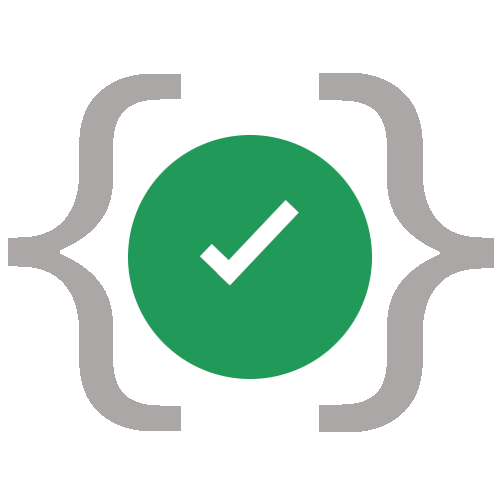

<div align="center">
  
  <h1>Config File Validator</h1>
  <p>Single cross-platform CLI tool to validate different configuration file types</p>
</div>

<p align="center">


  <a href="https://scorecard.dev/viewer/?uri=github.com/Boeing/config-file-validator">
    
  </a>

  <a href="https://www.bestpractices.dev/projects/9027">
    
  </a>

  <a href="https://opensource.org/licenses/Apache-2.0">
  
  </a>

  <a href="https://github.com/avelino/awesome-go">
  
  </a>  

  <a href="https://pkg.go.dev/github.com/Boeing/config-file-validator">
  
  </a>

  <a href="https://goreportcard.com/report/github.com/Boeing/config-file-validator">
  
  </a>

  <a href="https://github.com/boeing/config-file-validator/actions/workflows/go.yml">
  
  </a>
</p>

## About

Config File Validator is a cross-platform CLI tool for validating and linting configuration files in your project. It supports syntax checking and JSON Schema validation for JSON, YAML, TOML, XML, HCL, INI, HOCON, ENV, CSV, Properties, EDITORCONFIG, PList, SARIF, and TOON files. Use it locally, in CI/CD pipelines, or as a Go library to catch configuration errors before deployment.

## Supported Configuration File Formats

| Format | Syntax Validation | Schema Validation |
|--------|:-----------------:|:-----------------:|
| Apple PList XML | ✅ | ❌ |
| CSV | ✅ | ❌ |
| EDITORCONFIG | ✅ | ❌ |
| ENV | ✅ | ❌ |
| HCL | ✅ | ❌ |
| HOCON | ✅ | ❌ |
| INI | ✅ | ❌ |
| JSON | ✅ | ✅ (`$schema` property) |
| Properties | ✅ | ❌ |
| SARIF | ✅ | ✅ (built-in per version) |
| TOML | ✅ | ✅ (`$schema` key) |
| TOON | ✅ | ✅ (`"$schema"` key) |
| XML | ✅ | ✅ (`xsi:noNamespaceSchemaLocation`) |
| YAML | ✅ | ✅ (`yaml-language-server` comment) |

XML files with inline DTD declarations (`<!DOCTYPE>`) are automatically validated against the DTD during syntax checking.

## Demo


## Installation

There are several options to install the config file validator tool.

### Binary Releases

Download and unpack from https://github.com/Boeing/config-file-validator/releases


### Package Managers

#### [Homebrew](https://brew.sh/)

```shell
brew install config-file-validator
```

#### [MacPorts](https://ports.macports.org)

```shell
sudo port install config-file-validator
```

#### [Aqua](https://aquaproj.github.io/)

```shell
aqua g -i Boeing/config-file-validator
```

#### [Winget](https://learn.microsoft.com/en-us/windows/package-manager/winget/)

```shell
winget install Boeing.config-file-validator
```

#### [Scoop](https://scoop.sh/)

```shell
scoop install config-file-validator
```

### Arch Linux

We maintain and release an [AUR package](https://aur.archlinux.org/packages/config-file-validator) for the config-file-validator

```shell
git clone https://aur.archlinux.org/config-file-validator.git
cd config-file-validator
makepkg -si
```

### `go install`

If you have a go environment on your desktop you can use [go install](https://go.dev/doc/go-get-install-deprecation) to install the validator executable. The validator executable will be installed to the directory named by the GOBIN environment variable, which defaults to $GOPATH/bin or $HOME/go/bin if the GOPATH environment variable is not set.

```shell
go install github.com/Boeing/config-file-validator/cmd/validator@latest
```

## Usage

```
Usage: validator [OPTIONS] [<search_path>...]

positional arguments:
    search_path: The search path on the filesystem for configuration files. Defaults to the current working directory if no search_path provided

Schema validation runs automatically when a file declares a schema:
  JSON:  {"$schema": "schema.json", ...}
  YAML:  # yaml-language-server: $schema=schema.json
  TOML:  "$schema" = "schema.json"
  TOON:  "$schema": schema.json
  XML:   xsi:noNamespaceSchemaLocation="schema.xsd"
  XML:   <!DOCTYPE> with inline DTD (validated during syntax check)

optional flags:
  -depth int
        Depth of recursion for the provided search paths. Set depth to 0 to disable recursive path traversal
  -exclude-dirs string
        Subdirectories to exclude when searching for configuration files
  -exclude-file-types string
        A comma separated list of file types to ignore
  -file-types string
        A comma separated list of file types to validate
  -globbing
        If globbing flag is set, check for glob patterns in the arguments.
  -groupby string
        Group output by filetype, directory, pass-fail. Supported for Standard and JSON reports
  -no-schema
        Disable all schema validation. Only syntax is checked.
        Cannot be used with --require-schema, --schema-map, or --schemastore.
  -quiet
        If quiet flag is set. It doesn't print any output to stdout.
  -reporter value
        Report format and optional output path. Format: <type>:<path> Supported: standard, json, junit, sarif (default: standard)
  -require-schema
        Fail validation if a file supports schema validation but does not declare a schema.
        Supported types: JSON ($schema property), YAML (yaml-language-server comment),
        TOML ($schema key), TOON ("$schema" key), XML (xsi:noNamespaceSchemaLocation).
        Other file types (INI, CSV, ENV, HCL, HOCON, Properties, PList, EditorConfig) are not affected.
        Cannot be used with --no-schema.
  -schema-map value
        Map a glob pattern to a schema file for validation.
        Format: <pattern>:<schema_path>
        Use JSON Schema (.json) for JSON, YAML, TOML, and TOON files.
        Use XSD (.xsd) for XML files. Paths are relative to the current directory.
        Multiple mappings can be specified.
        Examples:
          --schema-map="**/package.json:schemas/package.schema.json"
          --schema-map="**/config.xml:schemas/config.xsd"
  -schemastore string
        Path to a local SchemaStore clone for automatic schema lookup by filename.
        Download with: git clone --depth=1 https://github.com/SchemaStore/schemastore.git
        Files matching the catalog are validated against the corresponding schema.
        Document-declared schemas and --schema-map take priority over SchemaStore.
  -type-map value
        Map a glob pattern to a file type. Format: <pattern>:<type> Example: --type-map="**/inventory:ini"
  -version
        Version prints the release version of validator
```

### Environment Variables

The config-file-validator supports setting options via environment variables. If both command-line flags and environment variables are set, the command-line flags will take precedence. The supported environment variables are as follows:

| Environment Variable | Equivalent Flag |
|----------------------|-----------------|
| `CFV_DEPTH`          | `-depth`        |
| `CFV_EXCLUDE_DIRS`   | `-exclude-dirs` |
| `CFV_EXCLUDE_FILE_TYPES` | `-exclude-file-types` |
| `CFV_FILE_TYPES`     | `-file-types`   |
| `CFV_REPORTER`       | `-reporter`     |
| `CFV_GROUPBY`        | `-groupby`      |
| `CFV_QUIET`          | `-quiet`        |
| `CFV_REQUIRE_SCHEMA`        | `-require-schema`      |
| `CFV_NO_SCHEMA`             | `-no-schema`           |
| `CFV_SCHEMASTORE`           | `-schemastore`         |
| `CFV_GLOBBING`          | `-globbing`  |

### Examples

#### Standard Run

If the search path is omitted it will search the current directory

```shell
validator /path/to/search
```


#### Multiple search paths

Multiple search paths are supported, and the results will be merged into a single report

```shell
validator /path/to/search /another/path/to/search
```


#### Exclude directories

Exclude subdirectories in the search path

```shell
validator --exclude-dirs=/path/to/search/tests /path/to/search
```


#### Exclude file types

Exclude file types in the search path. Available file types are `csv`, `env`, `hcl`, `hocon`, `ini`, `json`, `plist`, `properties`, `toml`, `toon`, `xml`, `yaml`, and `yml`

```shell
validator --exclude-file-types=json /path/to/search
```


#### Include only specific file types

Validate only the specified file types. Cannot be used together with `--exclude-file-types`.

```shell
validator --file-types=json,yaml /path/to/search
```

#### Customize recursion depth

By default there is no recursion limit. If desired, the recursion depth can be set to an integer value. If depth is set to `0` recursion will be disabled and only the files in the search path will be validated.

```shell
validator --depth=0 /path/to/search
```


#### Customize report output

You can customize the report output and save the results to a file (default name is result.{extension}). The available report types are `standard`, `junit`, `json`, and `sarif`. You can specify multiple report types by chaining the `--reporter` flags.

You can specify a path to an output file for any reporter by appending `:<path>` to the name of the reporter. Providing an output file is optional and the results will be printed to stdout by default. To explicitly direct the output to stdout, use `:-` as the file path.

```shell
validator --reporter=json:- /path/to/search
validator --reporter=json:output.json --reporter=standard /path/to/search
```


### Group report output

Group the report output by file type, directory, or pass-fail. Supports one or more groupings.

```shell
validator -groupby filetype
```


#### Multiple groups

```shell
validator -groupby directory,pass-fail
```


### Output results to a file

Output report results to a file (default name is `result.{extension}`). Must provide reporter flag with a supported extension format. Available options are `junit` and `json`. If an existing directory is provided, create a file named default name in the given directory. If a file name is provided, create a file named the given name at the current working directory.

```shell
validator --reporter=json --output=/path/to/dir
```

### Suppress output

Passing the `--quiet` flag suppresses all output to stdout. If there are invalid config files the validator tool will exit with 1. Any errors in execution such as an invalid path will still be displayed.

```shell
validator --quiet /path/to/search
```


### Schema validation

Schema validation runs automatically for file types that support it. Files without a schema declaration pass with syntax validation only. The document is converted to JSON internally and validated against the referenced [JSON Schema](https://json-schema.org/).

Use `--require-schema` to fail validation for files that support schema validation but don't declare a schema:

```shell
validator --require-schema /path/to/search
```

#### Declaring a schema

Each file type uses a different convention to declare its schema:

**JSON** — Add a `$schema` property at the top level:

```json
{
  "$schema": "https://json.schemastore.org/package.json",
  "name": "my-package",
  "version": "1.0.0"
}
```

**YAML** — Add a `yaml-language-server` modeline comment before any content:

```yaml
# yaml-language-server: $schema=https://json.schemastore.org/github-workflow.json
name: CI
on: push
jobs:
  build:
    runs-on: ubuntu-latest
```

**TOML** — Add a `$schema` key at the top level:

```toml
"$schema" = "https://json.schemastore.org/pyproject.json"

[project]
name = "my-project"
version = "1.0.0"
```

**TOON** — Add a quoted `"$schema"` key at the top level:

```
"$schema": https://example.com/schema.json
host: localhost
port: 5432
```

**SARIF** — Schema validation is built-in per SARIF version (2.1.0 and 2.2). No declaration needed.

**XML** — Add an `xsi:noNamespaceSchemaLocation` attribute on the root element:

```xml
<?xml version="1.0"?>
<config xmlns:xsi="http://www.w3.org/2001/XMLSchema-instance"
        xsi:noNamespaceSchemaLocation="config.xsd">
  <host>db.example.com</host>
  <port>5432</port>
</config>
```

XML schemas use XSD (XML Schema Definition) files rather than JSON Schema.

Schema URLs can be absolute (`https://...`), absolute file paths, or relative paths (resolved from the document's directory).

### Map file types with glob patterns

Use the `--type-map` flag to map files matching a glob pattern to a specific file type. This is useful for files without extensions or with non-standard extensions. Multiple mappings can be specified.

```shell
# Treat all files named "inventory" as ini
validator --type-map="**/inventory:ini" /path/to/search

# Map all files in a configs directory as properties
validator --type-map="**/configs/*:properties" /path/to/search

# Multiple mappings
validator --type-map="**/inventory:ini" --type-map="**/*.cfg:json" /path/to/search
```

### Search files using a glob pattern

Use the `-globbing` flag to validate files matching a specified pattern. Include the pattern as a positional argument in double quotes. Multiple glob patterns and direct file paths are supported. If invalid config files are detected, the validator tool exits with code 1, and errors (e.g., invalid patterns) are displayed.

[Learn more about glob patterns](https://www.digitalocean.com/community/tools/glob)

```shell
# Validate all `.json` files in a directory
validator -globbing "/path/to/files/*.json"

# Recursively validate all `.json` files in subdirectories
validator -globbing "/path/to/files/**/*.json"

# Mix glob patterns and paths
validator -globbing "/path/*.json" /path/to/search
```

## Calling the config-file-validator programmatically

The config-file-validator can be called programmatically from within a Go program through the `cli` package.

### Default configuration

The default configuration will perform the following actions:

* Search for all supported configuration file types in the current directory and its subdirectories 
* Uses the default reporter which will output validation results to console (stdout)

```go
package main

import (
	"os"
	"log"

	"github.com/Boeing/config-file-validator/pkg/cli"
)

func main() {

	// Initialize the CLI
	cfv := cli.Init()
	
	// Run the config file validation
	exitStatus, err := cfv.Run()
	if err != nil {
	  log.Printf("Errors occurred during execution: %v", err)
	}
	
	os.Exit(exitStatus)
}
```

### Custom Search Paths

The below example will search the provided search paths.

```go
package main

import (
	"os"
	"log"

	"github.com/Boeing/config-file-validator/pkg/cli"
	"github.com/Boeing/config-file-validator/pkg/finder"
)

func main() {

	// Initialize a file system finder
	fileSystemFinder := finder.FileSystemFinderInit(
		finder.WithPathRoots("/path/to/search", "/another/path/to/search"),
	)

	// Initialize the CLI
	cfv := cli.Init(
		cli.WithFinder(fileSystemFinder),
	)
	
	// Run the config file validation
	exitStatus, err := cfv.Run()
	if err != nil {
	  log.Printf("Errors occurred during execution: %v", err)
	}
	
	os.Exit(exitStatus)
}
```

### Custom Reporter

Will output JSON to stdout. To output to a file, pass a value to the `reporter.NewJSONReporter` constructor.

```go
package main

import (
	"os"
	"log"

	"github.com/Boeing/config-file-validator/pkg/cli"
	"github.com/Boeing/config-file-validator/pkg/reporter"
)

func main() {
	// Initialize reporter type
	var outputDir string
	jsonReporter := reporter.NewJSONReporter(outputDir)

	// Initialize the CLI
	cfv := cli.Init(
		cli.WithFinder(fileSystemFinder),
		cli.WithReporters(jsonReporter),
	)
	
	// Run the config file validation
	exitStatus, err := cfv.Run()
	if err != nil {
	  log.Printf("Errors occurred during execution: %v", err)
	}
	
	os.Exit(exitStatus)
}
```

### Additional Configuration Options

#### Exclude Directories

```go
excludeDirs := []string{"test", "subdir"}
fileSystemFinder := finder.FileSystemFinderInit(
	finder.WithExcludeDirs(excludeDirs),
)
cfv := cli.Init(
      cli.WithFinder(fileSystemFinder),
)
```

#### Exclude File Types

```go
excludeFileTypes := []string{"yaml", "json"}
fileSystemFinder := finder.FileSystemFinderInit(
      finder.WithExcludeFileTypes(excludeFileTypes),
)
cfv := cli.Init(
      cli.WithFinder(fileSystemFinder),
)
```

#### Set Recursion Depth

```go
fileSystemFinder := finder.FileSystemFinderInit(
      finder.WithDepth(0)
)
cfv := cli.Init(
      cli.WithFinder(fileSystemFinder),
)
```

### Suppress Output

```go
cfv := cli.Init(
      cli.WithQuiet(true),
)
```

### Group Output

```go
groupOutput := []string{"pass-fail"} 
cfv := cli.Init(
      cli.WithGroupOutput(groupOutput),
)
```

### Schema Validation Options

#### Require Schema

Fail validation for files that support schema validation but don't declare one.

```go
cfv := cli.Init(
      cli.WithRequireSchema(true),
)
```

#### Disable Schema Validation

Skip all schema validation. Only syntax is checked.

```go
cfv := cli.Init(
      cli.WithNoSchema(true),
)
```

#### Schema Map

Map file patterns to schema files. Use JSON Schema (`.json`) for JSON, YAML, TOML, and TOON files. Use XSD (`.xsd`) for XML files.

```go
schemaMap := map[string]string{
      "**/package.json": "schemas/package.schema.json",
      "**/config.xml":   "schemas/config.xsd",
}
cfv := cli.Init(
      cli.WithSchemaMap(schemaMap),
)
```

#### SchemaStore

Use a local [SchemaStore](https://github.com/SchemaStore/schemastore) clone for automatic schema lookup by filename.

```go
import "github.com/Boeing/config-file-validator/pkg/schemastore"

store, err := schemastore.Open("/path/to/schemastore")
if err != nil {
      log.Fatal(err)
}
cfv := cli.Init(
      cli.WithSchemaStore(store),
)
```

## Build

The project can be downloaded and built from source using an environment with Go 1.26+ installed. After a successful build, the binary can be moved to a location on your operating system PATH.

### macOS

#### Build

```shell
CGO_ENABLED=0 \
GOOS=darwin \
GOARCH=arm64 \ # for Intel use amd64
go build \
-ldflags='-w -s -extldflags "-static"' \
-tags netgo \
-o validator \
cmd/validator/validator.go
```

#### Install

```shell
cp ./validator /usr/local/bin/
chmod +x /usr/local/bin/validator
```

### Linux

#### Build

```shell
CGO_ENABLED=0 \
GOOS=linux \
GOARCH=amd64 \
go build \
-ldflags='-w -s -extldflags "-static"' \
-tags netgo \
-o validator \
cmd/validator/validator.go
```

#### Install

```shell
cp ./validator /usr/local/bin/
chmod +x /usr/local/bin/validator
```

### Windows

#### Build

```powershell
$env:CGO_ENABLED = '0'; `
$env:GOOS = 'windows'; `
$env:GOARCH = 'amd64'; `
go build `
-ldflags='-w -s -extldflags "-static"' `
-tags netgo `
-o validator.exe `
cmd/validator/validator.go
```

#### Install

The below script will install the config-file-validator as a user to Local App Data:

```powershell
$install = Join-Path $env:LOCALAPPDATA 'Programs\validator'; `
New-Item -Path $install -ItemType Directory -Force | Out-Null; `
Copy-Item -Path .\validator.exe -Destination $install -Force; `
$up = [Environment]::GetEnvironmentVariable('Path', [EnvironmentVariableTarget]::User); `
if (-not ($up.Split(';') -contains $install)) { `
  $new = if ([string]::IsNullOrEmpty($up)) { $install } else { $up + ';' + $install }; `
  [Environment]::SetEnvironmentVariable('Path', $new, [EnvironmentVariableTarget]::User); `
  Write-Host "Added $install to User PATH. Open a new shell to pick up the change."; `
} else { `
  Write-Host "$install is already in the User PATH."; `
}
```

### Docker

You can also use the provided Dockerfile to build the config file validator tool as a container

```shell
docker build . -t config-file-validator:latest
```

## Contributors

<a href="https://github.com/Boeing/config-file-validator/graphs/contributors">
  
</a>

## Contributing

We welcome contributions! Please refer to our [contributing guide](./CONTRIBUTING.md)

## License

The Config File Validator is released under the [Apache 2.0](./LICENSE) License
