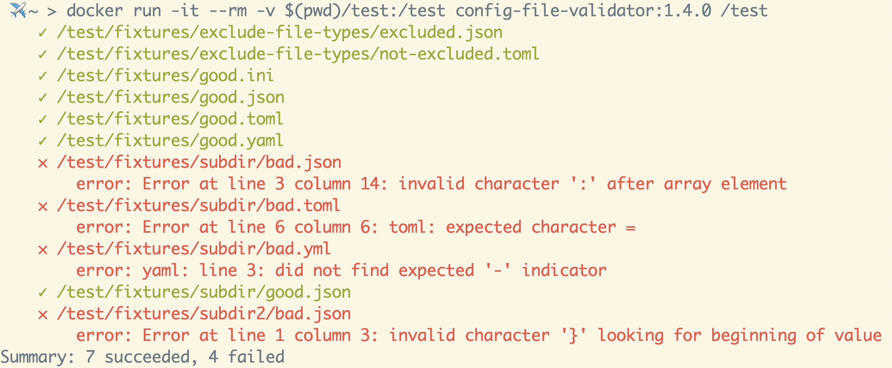

<div align="center">
  
  <h1>Config File Validator</h1>
  <p>Single cross-platform CLI tool to validate different configuration file types</p>
</div>

<p align="center">


  <a href="https://opensource.org/licenses/Apache-2.0">
  
  </a>

  <a href="https://pkg.go.dev/github.com/Boeing/config-file-validator">
  
  </a>

  <a href="https://goreportcard.com/report/github.com/Boeing/config-file-validator">
  
  </a>

  <a href="https://github.com/boeing/config-file-validator/actions/workflows/go.yml">
  
  </a>
</p>

## Supported config files formats:
* Apple PList XML
* CSV
* HCL
* INI
* JSON
* Properties
* TOML
* XML
* YAML

## Demo


## Installation
There are several ways to install the config file validator tool

### Docker

We offer alpine, ubuntu, and scratch containers

#### Alpine

```
docker pull ghcr.io/boeing/config-file-validator:v1.5.0
```

#### Ubuntu

```
docker pull ghcr.io/boeing/config-file-validator-ubuntu:v1.5.0
```

#### Scratch

```
docker pull ghcr.io/boeing/config-file-validator-scratch:v1.5.0
```

### Binary Releases
Download and unpack from https://github.com/Boeing/config-file-validator/releases

### Aqua
You can install the validator using [aqua](https://aquaproj.github.io/).

```
aqua g -i Boeing/config-file-validator
```

### Arch Linux
We release a [PKGBUILD](https://github.com/Boeing/config-file-validator/blob/main/PKGBUILD) file for Arch Linux

```
cd config-file-validator
makepkg -si
```

### `go install`
If you have a go environment on your desktop you can use [go install](https://go.dev/doc/go-get-install-deprecation) to install the validator executable. The validator executable will be installed to the directory named by the GOBIN environment variable, which defaults to $GOPATH/bin or $HOME/go/bin if the GOPATH environment variable is not set.

```
go install github.com/Boeing/config-file-validator/cmd/validator@v1.5.0
```

## Usage
```
Usage: validator [OPTIONS] [<search_path>...]

positional arguments:
    search_path: The search path on the filesystem for configuration files. Defaults to the current working directory if no search_path provided. Multiple search paths can be declared separated by a space.

optional flags:
  -depth int
    	Depth of recursion for the provided search paths. Set depth to 0 to disable recursive path traversal
  -exclude-dirs string
    	Subdirectories to exclude when searching for configuration files
  -exclude-file-types string
    	A comma separated list of file types to ignore
  -groupby string
        Group the output by filetype, pass-fail, or directory
  -reporter string
    	Format of the printed report. Options are standard and json (default "standard")
  -version
    	Version prints the release version of validator
```

### Examples
#### Standard Run
If the search path is omitted it will search the current directory
```
validator /path/to/search
```


#### Multiple search paths
Multiple search paths are supported and the results will be merged into a single report
```
validator /path/to/search /another/path/to/search
```


#### Exclude directories
Exclude subdirectories in the search path

```
validator --exclude-dirs=/path/to/search/tests /path/to/search
```


#### Exclude file types
Exclude file types in the search path. Available file types are `csv`, `hcl`, `ini`, `json`, `plist`, `properties`, `toml`, `xml`, `yaml`, and `yml`

```
validator --exclude-file-types=json /path/to/search
```


#### Customize recursion depth
By default there is no recursion limit. If desired, the recursion depth can be set to an integer value. If depth is set to `0` recursion will be disabled and only the files in the search path will be validated.

```
validator --depth=0 /path/to/search
```


#### Customize report output
Customize the report output. Available options are `standard` and `json`

```
validator --reporter=json /path/to/search
```


### Group report output
Group the report output by file type, directory, or pass-fail. Supports one or more groupings.

```
validator -groupby filetype
validator -groupby directory,pass-fail
```


#### Container Run
```
docker run -it --rm -v /path/to/config/files:/test config-file-validator:1.5.0 /test
```



## Build
The project can be downloaded and built from source using an environment with golang 1.21 installed. After a successful build, the binary can be moved to a location on your operating system PATH.

### MacOS
#### Build
```
CGO_ENABLED=0 \
GOOS=darwin \
GOARCH=amd64 \ # for Apple Silicon use arm64
go build \
-ldflags='-w -s -extldflags "-static"' \
-tags netgo \
-o validator \
cmd/validator/validator.go
```

#### Install
```
cp ./validator /usr/local/bin/
chmod +x /usr/local/bin/validator
```

### Linux
#### Build
```
CGO_ENABLED=0 \
GOOS=linux \
GOARCH=amd64 \
go build \
-ldflags='-w -s -extldflags "-static"' \
-tags netgo \
-o validator \
cmd/validator/validator.go
```

#### Install
```
cp ./validator /usr/local/bin/
chmod +x /usr/local/bin/validator
```

### Windows
#### Build
```
CGO_ENABLED=0 \
GOOS=windows \
GOARCH=amd64 \
go build \
-ldflags='-w -s -extldflags "-static"' \
-tags netgo \
-o validator.exe \
cmd/validator/validator.go
```

#### Install
```powershell
mkdir -p 'C:\Program Files\validator'
cp .\validator.exe 'C:\Program Files\validator'
[Environment]::SetEnvironmentVariable("C:\Program Files\validator", $env:Path, [System.EnvironmentVariableTarget]::Machine)
```

### Docker
You can also use the provided Dockerfile to build the config file validator tool as a container

```
docker build . -t config-file-validator:v1.5.0
```

## Contributing
We welcome contributions! Please refer to our [contributing guide](/CONTRIBUTING.md)

## License
The Config File Validator is released under the [Apache 2.0](/LICENSE) License
