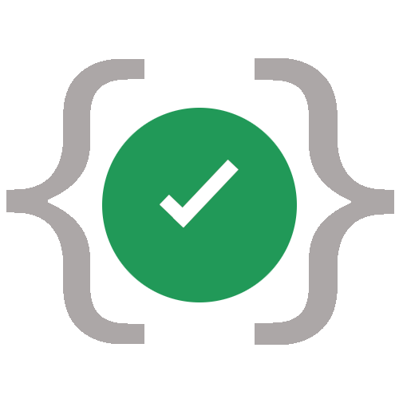
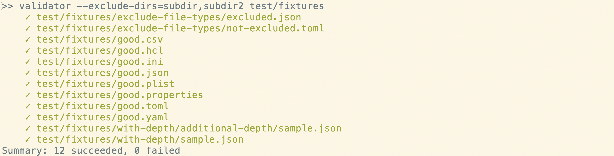
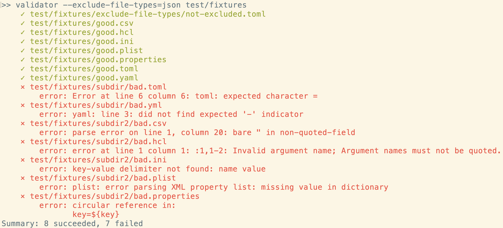
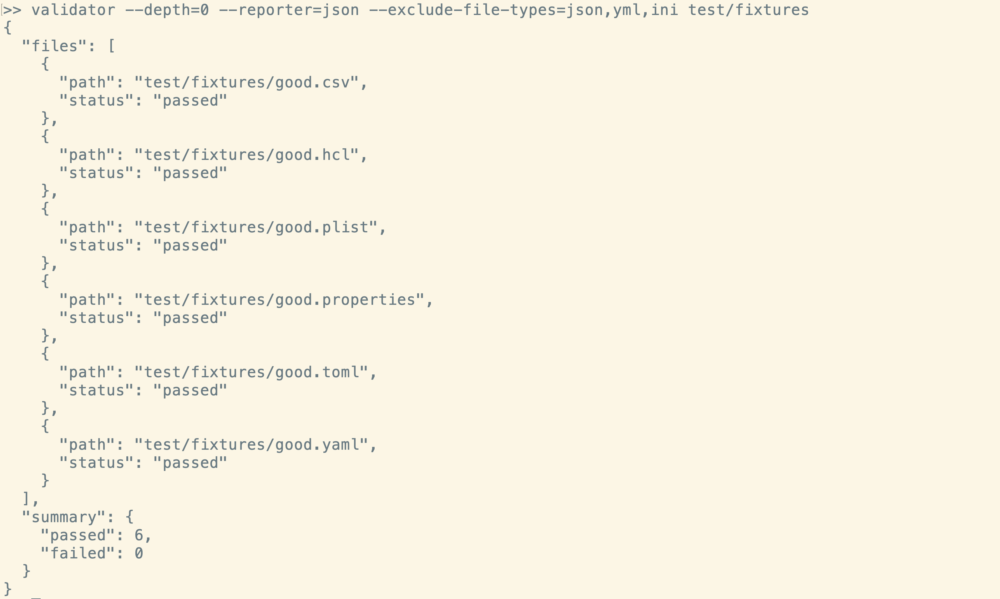
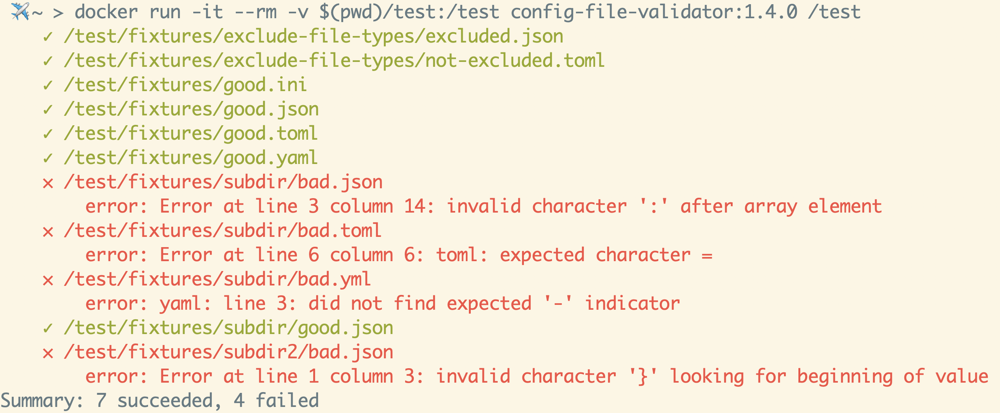

<div align="center">
    <div style="width: 100%; text-align: center; position: relative;">
        <div style="display: inline-block;">
            
        </div>
        <div style="position: absolute; right: 0; top: 0">
            <a href="https://github.com/Boeing/config-file-validator">
                
            </a>
        </div>
    </div>
    <div>
        <h1>Config File Validator</h1>
    </div>
</div>

<p align="center">
  <a href="https://opensource.org/licenses/Apache-2.0">
  
  </a>

  <a href="https://pkg.go.dev/github.com/Boeing/config-file-validator">
  
  </a>

  <a href="https://goreportcard.com/report/github.com/Boeing/config-file-validator">
  
  </a>

  <a href="https://github.com/boeing/config-file-validator/actions/workflows/go.yml">
  
  </a>
</p>

## About
How many deployments have you done that needed to be rolled back due to a missing character in a configuration file in your repo? If you're like most teams that number is greater than zero. The config file validator was created to solve this problem by searching through your project and validating the syntax of all configuration files. 

### Where can you use this tool?
* In a CI/CD pipeline as a quality gate
* On your desktop to validate configuration files as you write them
* As a library within your existing go code

### What types of files are supported?
* XML
* JSON
* YAML
* TOML
* INI
* Properties
* HCL

## Installing
There are several ways to install the config file validator tool

### Using `go install`
If you have a go environment on your desktop you can use [go install](https://go.dev/doc/go-get-install-deprecation) to install the validator executable. The validator executable will be installed to the directory named by the GOBIN environment variable, which defaults to $GOPATH/bin or $HOME/go/bin if the GOPATH environment variable is not set.

```
go install github.com/Boeing/config-file-validator/cmd/validator
```


### Executables
The config-file-validator is built as a statically linked binary which can be downloaded and executed on your target system. Binaries are available for Linux, Windows, and MacOS. Navigate to the [releases](https://github.com/Boeing/config-file-validator/releases) page to download the latest version. Once the binary has been downloaded it needs to be installed by moving the downloaded file to a location on your operating system's PATH.

## Using
```
Usage: validator [OPTIONS] [<search_path>...]

positional arguments:
    search_path: The search path on the filesystem for configuration files. Defaults to the current working directory if no search_path provided

optional flags:
  -exclude-dirs string
        Subdirectories to exclude when searching for configuration files
  -exclude-file-types string
        A comma separated list of file types to ignore
  -reporter string
        Format of the printed report. Options are standard and json (default "standard")
```

### Examples
#### Standard Run
If the search path is omitted it will search the current directory
```
validator /path/to/search
```


#### Exclude dirs
Exclude subdirectories in the search path

```
validator --exclude-dirs=/path/to/search/tests /path/to/search 
```



#### Exclude file types
Exclude file types in the search path. Available file types are `ini`, `json`, `yaml`, `yml`, `toml`, `xml`, `properties`, and `hcl`

```
validator --exclude-file-types=json /path/to/search
```



#### Customize report output
Customize the report output. Available options are `standard` and `json`

```
validator --reporter=json /path/to/search
```




#### Container Run
```
docker run -it --rm -v /path/to/config/files:/test config-file-validator:1.4.0 /test
```



## Building from source
The project can be downloaded and built from source using an environment with golang 1.17+ installed. After successful build, the statically-linked binary can be moved to a location on your operating system PATH.

### Linux
#### Build
```
CGO_ENABLED=0 \
GOOS=linux \
GOARCH=amd64 \
go build \
-ldflags='-w -s -extldflags "-static"' \
-tags netgo \
-o validator \
cmd/validator/validator.go
```

#### Install
```
cp ./validator /usr/local/bin/
chmod +x /usr/local/bin/validator
```

### Windows
#### Build
```
CGO_ENABLED=0 \
GOOS=windows \
GOARCH=amd64 \
go build \
-ldflags='-w -s -extldflags "-static"' \
-tags netgo \
-o validator.exe \
cmd/validator/validator.go
```

#### Install
```powershell
mkdir -p 'C:\Program Files\validator'
cp .\validator.exe 'C:\Program Files\validator'
[Environment]::SetEnvironmentVariable("C:\Program Files\validator", $env:Path, [System.EnvironmentVariableTarget]::Machine)
```

### Docker
You can also use the provided Dockerfile to build the config file validator tool in a container

```
docker build . -t config-file-validator
```

## Contributing
We welcome contributions! Please refer to our [contributing guide](/CONTRIBUTING.md)

## License
The Config File Validator is released under the [Apache 2.0](/LICENSE) License