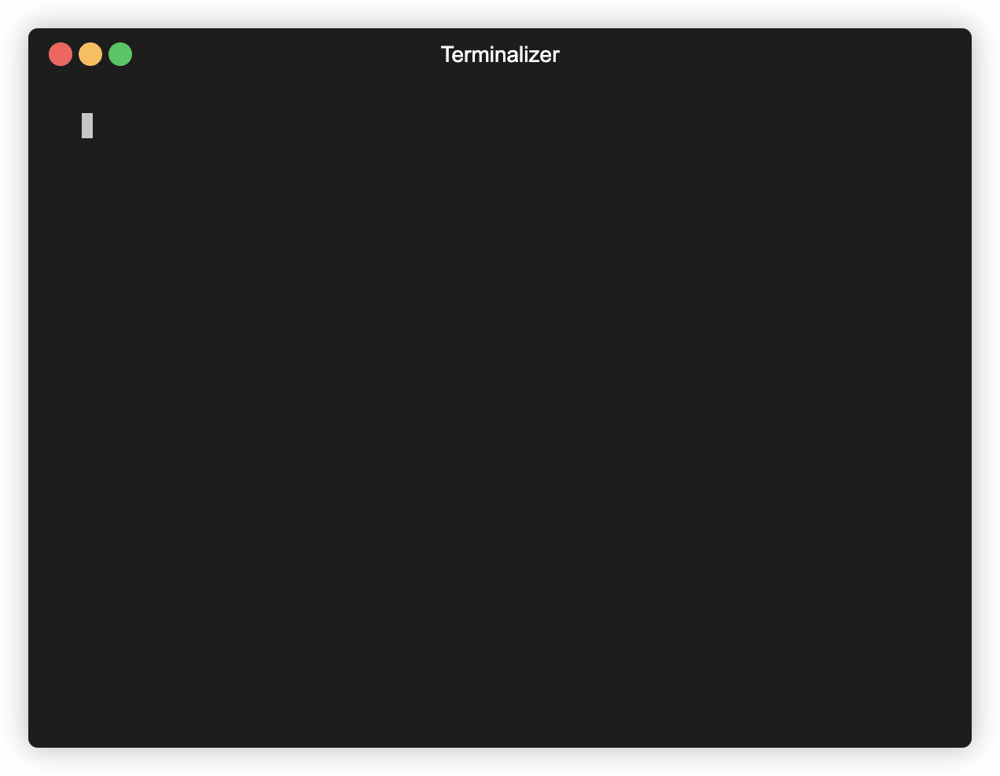
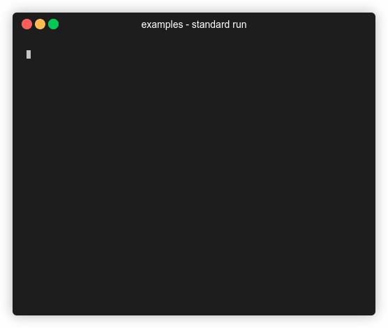
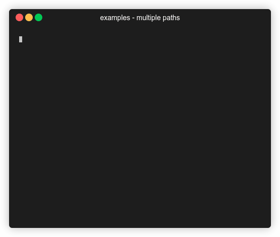
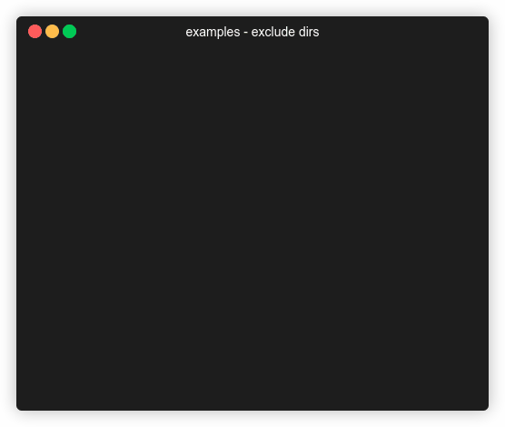

<p align="center">


  <a href="https://scorecard.dev/viewer/?uri=github.com/Boeing/config-file-validator">
    
  </a>

  <a href="https://www.bestpractices.dev/projects/9027">
    
  </a>

  <a href="https://opensource.org/licenses/Apache-2.0">
  
  </a>

  <a href="https://github.com/avelino/awesome-go">
  
  </a>  

  <a href="https://pkg.go.dev/github.com/Boeing/config-file-validator/v2">
  
  </a>

  <a href="https://goreportcard.com/report/github.com/Boeing/config-file-validator">
  
  </a>

  <a href="https://github.com/boeing/config-file-validator/actions/workflows/go.yml">
  
  </a>
</p>

## About

Config File Validator is a cross-platform CLI tool that validates configuration files in your project. Catch syntax errors, schema violations, and misconfigurations across all your config files — with one tool.

- **Single binary, zero dependencies** — no runtimes, no package managers, just one executable
- **16 file formats** — JSON, JSONC, YAML, TOML, XML, HCL, INI, HOCON, ENV, CSV, Properties, EDITORCONFIG, Justfile, PList, SARIF, and TOON
- **Syntax + schema validation** — validates structure with [JSON Schema](https://json-schema.org/) and XSD, with automatic [SchemaStore](https://www.schemastore.org/) integration
- **CI/CD ready** — JSON, JUnit, and SARIF output for GitHub Actions, GitLab CI, Jenkins, and more
- **Configurable** — project-level `.cfv.toml` config files, glob patterns, schema mappings, and environment variables
- **Usable as a Go library** — embed validation in your own tools with the `cli` package

## Table of Contents

- [Supported File Types](#supported-file-types)
- [Demo](#demo)
- [Installation](#installation)
- [GitHub Action](#github-action)
- [Pre-commit Hook](#pre-commit-hook)
- [Usage](#usage)
  - [Configuration File](#configuration-file)
  - [Environment Variables](#environment-variables)
  - [Examples](#examples)
  - [Schema Validation](#schema-validation)
- [Go API](#calling-the-config-file-validator-programmatically)
- [Build](#build)
- [Contributing](#contributing)

## Supported File Types

## Supported File Types

| Format | Syntax | Schema |
|--------|:------:|:------:|
| Apple PList XML | ✅ | ❌ |
| CSV | ✅ | ❌ |
| EDITORCONFIG | ✅ | ❌ |
| ENV | ✅ | ❌ |
| HCL | ✅ | ❌ |
| HOCON | ✅ | ❌ |
| INI | ✅ | ❌ |
| Justfile | ✅ | ❌ |
| JSON | ✅ | ✅ |
| JSONC | ✅ | ✅ |
| Properties | ✅ | ❌ |
| SARIF | ✅ | ✅ |
| TOML | ✅ | ✅ |
| TOON | ✅ | ✅ |
| XML | ✅ | ✅ |
| YAML | ✅ | ✅ |

XML files with inline DTD declarations (`<!DOCTYPE>`) are automatically validated against the DTD during syntax checking.

### Known Files

The validator automatically recognizes common configuration files by filename, even without a standard extension. This means files like `.babelrc`, `.gitconfig`, `Pipfile`, and `pom.xml` are validated without any configuration.

Known filenames are sourced from [GitHub Linguist](https://github.com/github-linguist/linguist) and updated automatically. Examples:

| Type | Known Files |
|------|-------------|
| JSON | `.arcconfig`, `.watchmanconfig`, `composer.lock`, `bun.lock`, `deno.lock`, `flake.lock` |
| JSONC | `.babelrc`, `.swcrc`, `.jshintrc`, `tsconfig.json`, `jsconfig.json`, `.eslintrc.json` |
| YAML | `.clang-format`, `.clang-tidy`, `.clangd`, `.gemrc` |
| TOML | `Pipfile`, `Cargo.lock`, `poetry.lock`, `uv.lock`, `pdm.lock` |
| XML | `pom.xml`, `build.xml`, `ant.xml`, `.classpath`, `.project` |
| INI | `.gitconfig`, `.gitmodules`, `.npmrc`, `.pylintrc`, `.flake8`, `.curlrc`, `.nanorc` |

Known files take priority over extension matching. For example, `tsconfig.json` is validated as JSONC (not strict JSON) because it’s a known JSONC file.

Use `--type-map` to override the automatic detection for any file:

```shell
# Force tsconfig.json to be validated as strict JSON
validator --type-map="**/tsconfig.json:json" .

### JSON vs JSONC

Files with the `.json` extension are validated as **strict JSON** — no comments, no trailing commas. Files with the `.jsonc` extension are validated as **JSONC**, which allows `//` line comments, `/* */` block comments, and trailing commas.

Many common `.json` files actually support JSONC syntax. The validator automatically detects these by filename and validates them as JSONC — no configuration needed:

`tsconfig.json`, `jsconfig.json`, `.eslintrc.json`, `.devcontainer.json`, `devcontainer.json`, `.babelrc`, `.jshintrc`, `.jslintrc`, `.jscsrc`, `.swcrc`, `tslint.json`, `api-extractor.json`, `language-configuration.json`, `.oxlintrc.json`

For other `.json` files that use JSONC syntax (e.g., VS Code settings), map them to the `jsonc` type using `--type-map` or `.cfv.toml`:

```shell
validator --type-map="**/.vscode/*.json:jsonc" .
Many tools use `.json` files that actually support JSONC syntax (e.g., `tsconfig.json`, VS Code settings). To validate these correctly, map them to the `jsonc` type using `--type-map` or `.cfv.toml`:

```shell
validator --type-map="**/.vscode/*.json:jsonc" .
```

Or in `.cfv.toml`:

```toml
[type-map]
"**/.vscode/*.json" = "jsonc"
```

JSON and JSONC are treated as a **family** — `--file-types=json` includes JSONC files, and `--exclude-file-types=json` excludes both JSON and JSONC files.

"**/tsconfig.json" = "jsonc"
"**/jsconfig.json" = "jsonc"
"**/devcontainer.json" = "jsonc"
"**/.vscode/*.json" = "jsonc"
```

JSON and JSONC are treated as a **family** — `--file-types=json` includes JSONC files, and `--exclude-file-types=json` excludes both JSON and JSONC files.

## Demo



## Installation

There are several options to install the config file validator tool.

### Binary Releases

Download and unpack from https://github.com/Boeing/config-file-validator/releases


### Package Managers

#### [Homebrew](https://brew.sh/)

```shell
brew install config-file-validator
```

#### [MacPorts](https://ports.macports.org)

```shell
sudo port install config-file-validator
```

#### [Aqua](https://aquaproj.github.io/)

```shell
aqua g -i Boeing/config-file-validator
```

#### [Winget](https://learn.microsoft.com/en-us/windows/package-manager/winget/)

```shell
winget install Boeing.config-file-validator
```

#### [Scoop](https://scoop.sh/)

```shell
scoop install config-file-validator
```

### Arch Linux

We maintain and release an [AUR package](https://aur.archlinux.org/packages/config-file-validator) for the config-file-validator

```shell
git clone https://aur.archlinux.org/config-file-validator.git
cd config-file-validator
makepkg -si
```

### `go install`

If you have a go environment on your desktop you can use [go install](https://go.dev/doc/go-get-install-deprecation) to install the validator executable. The validator executable will be installed to the directory named by the GOBIN environment variable, which defaults to $GOPATH/bin or $HOME/go/bin if the GOPATH environment variable is not set.

```shell
go install github.com/Boeing/config-file-validator/v2/cmd/validator@latest
```

## GitHub Action

A GitHub Action is available to run the config-file-validator as part of your CI/CD pipeline. It posts validation results as PR comments with inline annotations on the affected files and lines.

```yaml
- uses: Boeing/validate-configs-action@v2.0.0
```

See the [validate-configs-action](https://github.com/Boeing/validate-configs-action) repository for full usage and configuration options.

## Pre-commit Hook

The config-file-validator can be used as a [pre-commit](https://pre-commit.com/) hook to validate config files before every commit.

```yaml
repos:
  - repo: https://github.com/Boeing/config-file-validator
    rev: v2.1.0
    hooks:
      - id: config-file-validator
```

Two hooks are available:

- `config-file-validator` — validates only changed config files (fast, for local development)
- `config-file-validator-full` — validates all config files in the repo (for CI)

To pass additional flags (e.g., `--schemastore`):

```yaml
hooks:
  - id: config-file-validator
    args: ['--schemastore']
```

## Usage

```
Usage: validator [OPTIONS] [<search_path>...]

positional arguments:
    search_path: The search path on the filesystem for configuration files. Defaults to the current working directory if no search_path provided. Use "-" to read from stdin (requires --file-types).

Schema validation runs automatically when a file declares a schema:
  JSON:  {"$schema": "schema.json", ...}
  YAML:  # yaml-language-server: $schema=schema.json
  TOML:  "$schema" = "schema.json"
  TOON:  "$schema": schema.json
  XML:   xsi:noNamespaceSchemaLocation="schema.xsd"
  XML:   <!DOCTYPE> with inline DTD (validated during syntax check)

optional flags:
  -depth int
        Depth of recursion for the provided search paths. Set depth to 0 to disable recursive path traversal
  -exclude-dirs string
        Subdirectories to exclude when searching for configuration files
  -exclude-file-types string
        A comma separated list of file types to ignore
  -file-types string
        A comma separated list of file types to validate
  -gitignore
        Skip files and directories matched by .gitignore patterns.
        Respects nested .gitignore files, .git/info/exclude, and global git ignore config.
        Only active inside a Git repository; ignored otherwise.
  -globbing
        If globbing flag is set, check for glob patterns in the arguments.
  -groupby string
        Group output by filetype, directory, pass-fail, error-type. Supported for Standard and JSON reports
  -no-schema
        Disable all schema validation. Only syntax is checked.
        Cannot be used with --require-schema, --schema-map, or --schemastore.
  -quiet
        If quiet flag is set. It doesn't print any output to stdout.
  -reporter value
        Report format and optional output path. Format: <type>:<path> Supported: standard, json, junit, sarif (default: standard)
  -require-schema
        Fail validation if a file supports schema validation but does not declare a schema.
        Supported types: JSON ($schema property), YAML (yaml-language-server comment),
        TOML ($schema key), TOON ("$schema" key), XML (xsi:noNamespaceSchemaLocation).
        Other file types (INI, CSV, ENV, HCL, HOCON, Properties, PList, EditorConfig) are not affected.
        Cannot be used with --no-schema.
  -schema-map value
        Map a glob pattern to a schema file for validation.
        Format: <pattern>:<schema_path>
        Use JSON Schema (.json) for JSON, YAML, TOML, and TOON files.
        Use XSD (.xsd) for XML files. Paths are relative to the current directory.
        Multiple mappings can be specified.
        Examples:
          --schema-map="**/package.json:schemas/package.schema.json"
          --schema-map="**/config.xml:schemas/config.xsd"
  -schemastore
        Enable automatic schema lookup by filename using the SchemaStore catalog.
        Schemas are fetched remotely and cached in ~/.cache/cfv/schemas/ (24h TTL).
        Document-declared schemas and --schema-map take priority over SchemaStore.
  -schemastore-path string
        Path to a local SchemaStore clone for automatic schema lookup by filename.
        Implies --schemastore. Use for air-gapped environments.
        Download with: git clone --depth=1 https://github.com/SchemaStore/schemastore.git
  -config string
        Path to a .cfv.toml configuration file.
        If not specified, searches for .cfv.toml in the current and parent directories.
  -no-config
        Disable automatic discovery of .cfv.toml configuration files.
  -type-map value
        Map a glob pattern to a file type. Format: <pattern>:<type> Example: --type-map="**/inventory:ini"
  -version
        Version prints the release version of validator
```

### Configuration File

The validator supports a `.cfv.toml` configuration file for setting project-level defaults. On startup, the validator searches for `.cfv.toml` in the current directory and walks up parent directories. Use `--config=<path>` to specify a file explicitly, or `--no-config` to disable auto-discovery.

The config file is validated against a built-in schema — typos and invalid values are caught immediately.

**Precedence order** (highest to lowest):

1. CLI flags
2. Configuration file (`.cfv.toml`)
3. Environment variables (`CFV_*`)
4. Built-in defaults

**Example `.cfv.toml`:**

```toml
exclude-dirs = ["node_modules", ".git", "vendor"]
exclude-file-types = ["csv"]
depth = 3
quiet = false
schemastore = true
require-schema = false
gitignore = false
reporter = ["standard"]
groupby = ["filetype", "pass-fail"]

[schema-map]
"**/package.json" = "schemas/package.schema.json"
"**/config.xml" = "schemas/config.xsd"

[type-map]
"**/inventory" = "ini"
"**/*.cfg" = "json"

[validators.csv]
delimiter = ";"
comment = "#"
```

**Supported keys:**

| Key | Type | Equivalent Flag |
|-----|------|-----------------|
| `exclude-dirs` | array of strings | `--exclude-dirs` |
| `exclude-file-types` | array of strings | `--exclude-file-types` |
| `file-types` | array of strings | `--file-types` |
| `depth` | integer (≥ 0) | `--depth` |
| `reporter` | array of strings | `--reporter` |
| `groupby` | array of strings | `--groupby` |
| `quiet` | boolean | `--quiet` |
| `require-schema` | boolean | `--require-schema` |
| `no-schema` | boolean | `--no-schema` |
| `schemastore` | boolean | `--schemastore` |
| `schemastore-path` | string | `--schemastore-path` |
| `globbing` | boolean | `--globbing` |
| `gitignore` | boolean | `--gitignore` |
| `schema-map` | table (pattern = path) | `--schema-map` |
| `type-map` | table (pattern = type) | `--type-map` |
| `validators` | table | Per-validator options (see below) |

**Validator options:**

| Key | Type | Default | Description |
|-----|------|---------|-------------|
| `validators.csv.delimiter` | string | `","` | Field delimiter. Use `"\t"` for tab. |
| `validators.csv.comment` | string | (none) | Lines starting with this character are ignored. |
| `validators.csv.lazy-quotes` | boolean | `false` | Allow quotes in unquoted fields. |
| `validators.json.forbid-duplicate-keys` | boolean | `false` | Report duplicate keys in objects as errors. |
| `validators.ini.forbid-duplicate-keys` | boolean | `false` | Report duplicate keys within the same section as errors. |

YAML duplicate keys are always rejected (enforced by the YAML parser).
| `schema-map` | table (pattern = path) | `--schema-map` |
| `type-map` | table (pattern = type) | `--type-map` |
| `validators` | table | Per-validator options (see below) |

**Validator options:**

| Key | Type | Default | Description |
|-----|------|---------|-------------|
| `validators.csv.delimiter` | string | `","` | Field delimiter. Use `"\t"` for tab. |
| `validators.csv.comment` | string | (none) | Lines starting with this character are ignored. |
| `validators.csv.lazy-quotes` | boolean | `false` | Allow quotes in unquoted fields. |
| `validators.json.forbid-duplicate-keys` | boolean | `false` | Report duplicate keys in objects as errors. |
| `validators.ini.forbid-duplicate-keys` | boolean | `false` | Report duplicate keys within the same section as errors. |

YAML duplicate keys are always rejected (enforced by the YAML parser).

### Environment Variables

The config-file-validator supports setting options via environment variables. If both command-line flags and environment variables are set, the command-line flags will take precedence. The supported environment variables are as follows:

| Environment Variable | Equivalent Flag |
|----------------------|-----------------|
| `CFV_DEPTH`          | `-depth`        |
| `CFV_EXCLUDE_DIRS`   | `-exclude-dirs` |
| `CFV_EXCLUDE_FILE_TYPES` | `-exclude-file-types` |
| `CFV_FILE_TYPES`     | `-file-types`   |
| `CFV_REPORTER`       | `-reporter`     |
| `CFV_GROUPBY`        | `-groupby`      |
| `CFV_QUIET`          | `-quiet`        |
| `CFV_REQUIRE_SCHEMA`        | `-require-schema`      |
| `CFV_NO_SCHEMA`             | `-no-schema`           |
| `CFV_SCHEMASTORE`           | `-schemastore`         |
| `CFV_SCHEMASTORE_PATH`      | `-schemastore-path`    |
| `CFV_GLOBBING`          | `-globbing`  |
| `CFV_GITIGNORE`         | `-gitignore` |

### Examples

#### Standard Run

If the search path is omitted it will search the current directory

```shell
validator /path/to/search
```



#### Multiple search paths

Multiple search paths are supported, and the results will be merged into a single report

```shell
validator /path/to/search /another/path/to/search
```



#### Exclude directories

Exclude subdirectories in the search path

```shell
validator --exclude-dirs=/path/to/search/tests /path/to/search
```



#### Skip gitignored files

Skip files and directories matched by `.gitignore` patterns. Respects nested `.gitignore` files, `.git/info/exclude`, and global git ignore config. Only active inside a Git repository.

```shell
validator --gitignore /path/to/search
```

#### Exclude file types

Exclude file types in the search path. JSON and JSONC are treated as a family — excluding one excludes both. Similarly, excluding `yaml` also excludes `yml`.

```shell
validator --exclude-file-types=json /path/to/search
```

Note: `--exclude-file-types` filters by file extension. Extensionless known files (like `.gitconfig` or `.babelrc`) are not affected by this flag. Use `--type-map` or `.cfv.toml` for fine-grained control.


#### Include only specific file types

Validate only the specified file types. Cannot be used together with `--exclude-file-types`.

```shell
validator --file-types=json,yaml /path/to/search
```

#### Customize recursion depth

By default there is no recursion limit. If desired, the recursion depth can be set to an integer value. If depth is set to `0` recursion will be disabled and only the files in the search path will be validated.

```shell
validator --depth=0 /path/to/search
```


#### Customize report output

You can customize the report output and save the results to a file (default name is result.{extension}). The available report types are `standard`, `junit`, `json`, and `sarif`. You can specify multiple report types by chaining the `--reporter` flags.

You can specify a path to an output file for any reporter by appending `:<path>` to the name of the reporter. Providing an output file is optional and the results will be printed to stdout by default. To explicitly direct the output to stdout, use `:-` as the file path.

```shell
validator --reporter=json:- /path/to/search
validator --reporter=json:output.json --reporter=standard /path/to/search
```


### Group report output

Group the report output by file type, directory, pass-fail, or error-type. Supports one or more groupings.

```shell
validator -groupby filetype
```


#### Multiple groups

```shell
validator -groupby directory,pass-fail
```


### Output results to a file

Output report results to a file (default name is `result.{extension}`). Must provide reporter flag with a supported extension format. Available options are `junit` and `json`. If an existing directory is provided, create a file named default name in the given directory. If a file name is provided, create a file named the given name at the current working directory.

```shell
validator --reporter=json --output=/path/to/dir
```

### Suppress output

Passing the `--quiet` flag suppresses all output to stdout. If there are invalid config files the validator tool will exit with 1. Any errors in execution such as an invalid path will still be displayed.

```shell
validator --quiet /path/to/search
```

### Read from stdin

Use `-` as the search path to read from stdin. Requires `--file-types` to specify exactly one file type.

```shell
echo '{"key": "value"}' | validator --file-types=json -
cat config.yaml | validator --file-types=yaml -
curl -s https://example.com/config.json | validator --file-types=json -
```

### Exit codes

The validator uses the following exit codes:

| Code | Meaning |
|------|--------|
| `0` | All files are valid |
| `1` | One or more validation errors (syntax or schema) |
| `2` | Runtime or configuration error (invalid flags, unreadable files, bad config) |

### Search files using a glob pattern

Use `-` as the search path to read from stdin. Requires `--file-types` to specify exactly one file type.

```shell
echo '{"key": "value"}' | validator --file-types=json -
cat config.yaml | validator --file-types=yaml -
curl -s https://example.com/config.json | validator --file-types=json -
```

### Exit codes

The validator uses the following exit codes:

| Code | Meaning |
|------|--------|
| `0` | All files are valid |
| `1` | One or more validation errors (syntax or schema) |
| `2` | Runtime or configuration error (invalid flags, unreadable files, bad config) |


### Schema validation

Schema validation runs automatically for file types that support it. Files without a schema declaration pass with syntax validation only. The document is converted to JSON internally and validated against the referenced [JSON Schema](https://json-schema.org/).

Use `--require-schema` to fail validation for files that support schema validation but don't declare a schema:

```shell
validator --require-schema /path/to/search
```

#### Declaring a schema

Each file type uses a different convention to declare its schema:

**JSON** — Add a `$schema` property at the top level:

```json
{
  "$schema": "https://json.schemastore.org/package.json",
  "name": "my-package",
  "version": "1.0.0"
}
```

**YAML** — Add a `yaml-language-server` modeline comment before any content:

```yaml
# yaml-language-server: $schema=https://json.schemastore.org/github-workflow.json
name: CI
on: push
jobs:
  build:
    runs-on: ubuntu-latest
```

**TOML** — Add a `$schema` key at the top level:

```toml
"$schema" = "https://json.schemastore.org/pyproject.json"

[project]
name = "my-project"
version = "1.0.0"
```

**TOON** — Add a quoted `"$schema"` key at the top level:

```
"$schema": https://example.com/schema.json
host: localhost
port: 5432
```

**SARIF** — Schema validation is built-in per SARIF version (2.1.0 and 2.2). No declaration needed.

**XML** — Add an `xsi:noNamespaceSchemaLocation` attribute on the root element:

```xml
<?xml version="1.0"?>
<config xmlns:xsi="http://www.w3.org/2001/XMLSchema-instance"
        xsi:noNamespaceSchemaLocation="config.xsd">
  <host>db.example.com</host>
  <port>5432</port>
</config>
```

XML schemas use XSD (XML Schema Definition) files rather than JSON Schema.

Schema URLs can be absolute (`https://...`), absolute file paths, or relative paths (resolved from the document's directory).

#### Automatic schema lookup with SchemaStore

[SchemaStore](https://www.schemastore.org/) is a community-maintained collection of JSON Schemas for hundreds of common configuration files — including `package.json`, `tsconfig.json`, `.eslintrc.json`, GitHub Actions workflows, `pyproject.toml`, and many more.

With the `--schemastore` flag, the validator automatically matches files by name against the SchemaStore catalog and validates them against the corresponding schema — no `$schema` declaration needed in your files.

**Usage:**

```shell
# Automatic schema lookup — schemas are fetched remotely and cached locally
validator --schemastore /path/to/project
```

For example, if your project contains a `package.json`, `tsconfig.json`, and `.github/workflows/ci.yml`, the validator will automatically find and apply the correct schema for each file without any configuration.

Schemas are cached in `~/.cache/cfv/schemas/` (or `$XDG_CACHE_HOME/cfv/schemas/`) with a 24-hour TTL, so subsequent runs don't require network access.

**Air-gapped / offline environments:**

For environments without internet access, use a local SchemaStore clone:

```shell
# Clone the SchemaStore catalog (only needed once)
git clone --depth=1 https://github.com/SchemaStore/schemastore.git

# Validate using the local clone
validator --schemastore-path=./schemastore /path/to/project
```

`--schemastore-path` implies `--schemastore` — you don't need to pass both.

**Priority order:** When multiple schema sources are available, the validator uses this precedence:

1. Schema declared in the document (`$schema`, `yaml-language-server`, `xsi:noNamespaceSchemaLocation`)
2. `--schema-map` patterns
3. `--schemastore` catalog lookup

This means document-level declarations always win, and `--schemastore` acts as a safety net for files that don't declare their own schema.

#### External schema mapping

Use `--schema-map` to apply a schema to files matching a glob pattern. This is useful when you can't or don't want to add schema declarations to the files themselves.

```shell
# Apply a JSON Schema to all package.json files
validator --schema-map="**/package.json:schemas/package.schema.json" /path/to/project

# Apply an XSD to XML config files
validator --schema-map="**/config.xml:schemas/config.xsd" /path/to/project

# Multiple mappings
validator --schema-map="**/package.json:schemas/pkg.json" \
          --schema-map="**/*.xml:schemas/config.xsd" /path/to/project
```

Use JSON Schema (`.json`) for JSON, YAML, TOML, and TOON files. Use XSD (`.xsd`) for XML files. Paths are relative to the current working directory.

### Map file types with glob patterns

Use the `--type-map` flag to map files matching a glob pattern to a specific file type. This is useful for files without extensions or with non-standard extensions. Multiple mappings can be specified.

```shell
# Treat all files named "inventory" as ini
validator --type-map="**/inventory:ini" /path/to/search

# Map all files in a configs directory as properties
validator --type-map="**/configs/*:properties" /path/to/search

# Multiple mappings
validator --type-map="**/inventory:ini" --type-map="**/*.cfg:json" /path/to/search
```

### Search files using a glob pattern

Use the `-globbing` flag to validate files matching a specified pattern. Include the pattern as a positional argument in double quotes. Multiple glob patterns and direct file paths are supported. If invalid config files are detected, the validator tool exits with code 1, and errors (e.g., invalid patterns) are displayed.

[Learn more about glob patterns](https://www.digitalocean.com/community/tools/glob)

```shell
# Validate all `.json` files in a directory
validator -globbing "/path/to/files/*.json"

# Recursively validate all `.json` files in subdirectories
validator -globbing "/path/to/files/**/*.json"

# Mix glob patterns and paths
validator -globbing "/path/*.json" /path/to/search
```

## Calling the config-file-validator programmatically

The config-file-validator can be used as a Go library. See the [Go API documentation](./docs/go-api.md) for examples including custom search paths, reporters, schema validation, and all configuration options.

```go
package main

import (
	"os"
	"log"

	"github.com/Boeing/config-file-validator/v2/pkg/cli"
)

func main() {
	cfv := cli.Init()
	exitStatus, err := cfv.Run()
	if err != nil {
	  log.Printf("Errors occurred during execution: %v", err)
	}
	os.Exit(exitStatus)
      cfv := cli.Init()
      exitStatus, err := cfv.Run()
      if err != nil {
        log.Printf("Errors occurred during execution: %v", err)
      }
      os.Exit(exitStatus)
}
```

## Build

The project can be downloaded and built from source using an environment with Go 1.26+ installed. After a successful build, the binary can be moved to a location on your operating system PATH.

### macOS

#### Build

```shell
CGO_ENABLED=0 \
GOOS=darwin \
GOARCH=arm64 \ # for Intel use amd64
go build \
-ldflags='-w -s -extldflags "-static"' \
-tags netgo \
-o validator \
cmd/validator/validator.go
```

#### Install

```shell
cp ./validator /usr/local/bin/
chmod +x /usr/local/bin/validator
```

### Linux

#### Build

```shell
CGO_ENABLED=0 \
GOOS=linux \
GOARCH=amd64 \
go build \
-ldflags='-w -s -extldflags "-static"' \
-tags netgo \
-o validator \
cmd/validator/validator.go
```

#### Install

```shell
cp ./validator /usr/local/bin/
chmod +x /usr/local/bin/validator
```

### Windows

#### Build

```powershell
$env:CGO_ENABLED = '0'; `
$env:GOOS = 'windows'; `
$env:GOARCH = 'amd64'; `
go build `
-ldflags='-w -s -extldflags "-static"' `
-tags netgo `
-o validator.exe `
cmd/validator/validator.go
```

#### Install

The below script will install the config-file-validator as a user to Local App Data:

```powershell
$install = Join-Path $env:LOCALAPPDATA 'Programs\validator'; `
New-Item -Path $install -ItemType Directory -Force | Out-Null; `
Copy-Item -Path .\validator.exe -Destination $install -Force; `
$up = [Environment]::GetEnvironmentVariable('Path', [EnvironmentVariableTarget]::User); `
if (-not ($up.Split(';') -contains $install)) { `
  $new = if ([string]::IsNullOrEmpty($up)) { $install } else { $up + ';' + $install }; `
  [Environment]::SetEnvironmentVariable('Path', $new, [EnvironmentVariableTarget]::User); `
  Write-Host "Added $install to User PATH. Open a new shell to pick up the change."; `
} else { `
  Write-Host "$install is already in the User PATH."; `
}
```

### Docker

You can also use the provided Dockerfile to build the config file validator tool as a container

```shell
docker build . -t config-file-validator:latest
```

## Contributors

<a href="https://github.com/Boeing/config-file-validator/graphs/contributors">
  
</a>

## Contributing

We welcome contributions! Please refer to our [contributing guide](./CONTRIBUTING.md)

## License

The Config File Validator is released under the [Apache 2.0](./LICENSE) License
